# Introduction
The developed multimedia mobile application aims to facilitate the effective study of the Chinese language by leveraging modern technologies such as augmented reality (AR) and cloud services. This innovative application provides users with the opportunity to immerse themselves in a language environment, interacting with 3D models, video tutorials, and quizzes, significantly enhancing their understanding of the language in a dynamic setting.

The application is built on the MVVM (Model-View-ViewModel) architectural pattern, which ensures a clear separation of concerns, making the codebase more maintainable and scalable. Kotlin is used as the programming language for Android development. To implement augmented reality functionality, Google's ARCore and Sceneform libraries are utilized, enabling motion tracking, surface recognition, and realistic rendering of virtual objects.

For playing video tutorials, the ExoPlayer library is employed, providing support for various formats and streaming protocols. Data storage and management are handled using cloud tools from Firebase, such as Firebase Firestore, Firebase Storage, and Firebase Realtime Database.

3D models in the application are represented in glTF and GLB formats, which are optimized for transmitting and displaying three-dimensional graphics. The glTF (GL Transmission Format) is a text-based format that allows for easy editing and updating of model components, while GLB is the binary version that combines all model components into a single file, ensuring fast loading and minimizing network requests.

Additionally, the application utilizes the Room database, which provides an abstraction layer over SQLite, allowing for more robust database management and easier data access. Room simplifies the process of working with databases in Android applications, enabling developers to define data entities and access methods using annotations, which enhances code readability and maintainability.

The integration of these advanced technologies not only supports the language acquisition process but also fosters the development of communication skills and adaptability to various linguistic contexts, ultimately motivating learners to engage more deeply with the study of the Chinese language.

# Implementation of the Program
## 1.1. Program Architecture
The developed application utilizes the MVVM (Model-View-ViewModel) architectural style. The MVVM pattern is one of the widely used architectural patterns in Android application development. This pattern helps structure the code in a way that separates business logic, data representation, and state management. Let's take a closer look at how to apply the MVVM pattern in Android applications.

The MVVM architectural style consists of three components:

Model: Responsible for managing the application's data. It includes business logic, network operations, and database access (data repositories, API services, databases such as Room, data entities). The Model handles processes for retrieving, processing, writing, and reading data.

ViewModel: Acts as a link between the Model and the View. The main tasks of the ViewModel are to prepare data for the View and manage the UI state. It ensures data persistence during screen rotations and other configuration changes and performs operations to transform data into the format required for presentation. The ViewModel serves as an intermediary between the Model and the View, facilitating data exchange through commands and events. ViewModel classes, LiveData, and StateFlow can be categorized under ViewModel.

View: Implements data display and is responsible for user interaction. In Android, the View is implemented through Activity, Fragment, or View.
<div style="text-align: center;">
  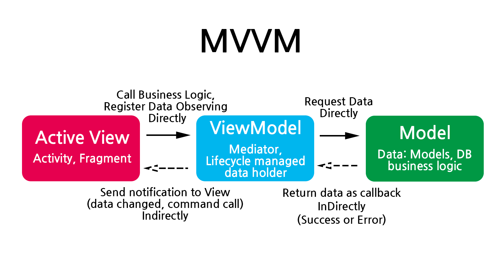
</div>

The pattern has the following characteristics:

- The View does not have information about the data model (Model) and vice versa.
- The Model cannot directly access the View to update its content.
- To interact, the ViewModel must be used, which extracts data from the Model, transforms it into the required format, and then redirects it to the View for display.
The MVVM pattern significantly improves the structure and maintainability of Android applications by providing a clear separation between the presentation and business logic.

## 1.2. Technologies Used in Application Development
The mobile application was developed for the Android platform, using Kotlin as the programming language.

To implement augmented reality (AR) functionality, the ARCore and Sceneform libraries were used. ARCore, developed by Google, provides capabilities for motion tracking, surface recognition, and light estimation, enabling the creation of interactive and realistic AR applications. Sceneform simplifies the rendering of 3D models and working with them, offering high-level APIs for integrating ARCore into the application.

For playing video tutorials, the ExoPlayer library was used. It is a flexible and powerful media player that supports a wide range of formats and streaming protocols.

Data storage and management are handled using Firebase tools such as Firebase Firestore, Firebase Storage, and Firebase Realtime Database.

## 1.3. Database Architecture
As part of the application development, a database was implemented to visually represent the data and structure of the application. Database schema includes tables such as "Users," "Statistics," "Lessons," "Lesson Types," "Levels," "Tests," "AR Room," "ML Kit," and "Words."

This schema visually demonstrates the data structure and relationships between them, which is a key aspect in ensuring the successful implementation of this educational application.

The use of this application implies a large amount of data: 3D models, video resources, tests. To store them, a server is required. It was decided to use Firebase services.

Firebase offers several powerful services for data storage and management: Firebase Storage, Realtime Database, and Cloud Firestore.

Firebase Storage: A cloud storage service from Google designed for storing and synchronizing user data such as photos, videos, and other files. Firebase Storage generates unique URLs for each file, which can be used to access them. URLs can be public or private depending on security settings.
<div style="text-align: center;">
  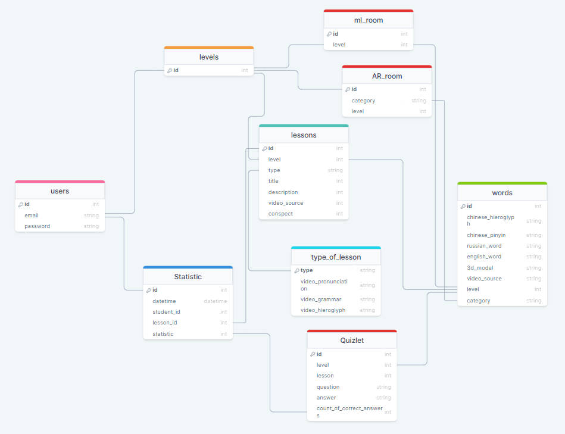
</div>

Firebase Realtime Database: A cloud database that provides real-time data storage and synchronization. It is used when applications need to exchange data quickly between clients and the server.
Key features of Firebase Realtime Database:

- Allows data to be updated on all connected clients instantly after changes.
- Supports offline data synchronization. Data is cached on the device and synchronized with the server once the device regains internet connectivity.
- Data is represented in a JSON structure.
Firebase Realtime Database supports executing queries on data, with filtering, sorting, and access control capabilities.

Firebase Firestore (also known as Cloud Firestore): A cloud NoSQL database used for storing, synchronizing, and querying data for mobile and web applications.
Key features of Firebase Firestore:

Firestore stores data in the form of collections and documents:
- Documents contain data in key-value pairs and can include nested data.
- Collections contain a list of documents. Each document is assigned a unique identifier (ID).
- Each document contains fields that can be of various formats: string, int, array, date, etc. This allows for the storage of diverse data.


Each of these has its own features, advantages, and disadvantages, making them suitable for different use cases. A comparison of these three services is provided in Table:

|Characteristic | Firebase Storage | Firebase Realtime Database | Cloud Firestore
| --- | --- | --- | --- |
|Data Type |Binary data (files)| Structured data (JSON)|Structured data (documents)|
|Real-time Synchronization| No | Yes | Yes |
|Query Mechanism|No|Limited capabilities (filtering, sorting)|Powerful and flexible queries|

## 1.4. Structure of Android application
<div style="text-align: center;">
  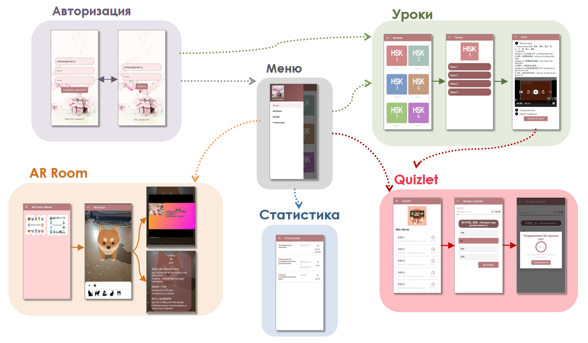
</div>

## 1.5. Authorization
The authorization section of the application allows for managing user access to the application's content. In this section, the "Login Screen" and "Registration Screen" are implemented.
<div style="text-align: center;">
   
</div>

Firebase Authentication provides the capability to manage user authentication. In addition to registration and login management, Firebase Authentication supports user session management, allowing for state preservation between application launches. Access to the application remains until the user logs out manually or their session is terminated.

Firebase offers functionality for managing accounts, including password recovery, email and password changes, and email verification.

In addition to classic authentication using email and password, Firebase provides alternative authentication methods, including login through social networks (Google, Facebook, Twitter) and anonymous access.


## 1.6. Lessons Section
<div style="text-align: center;">
  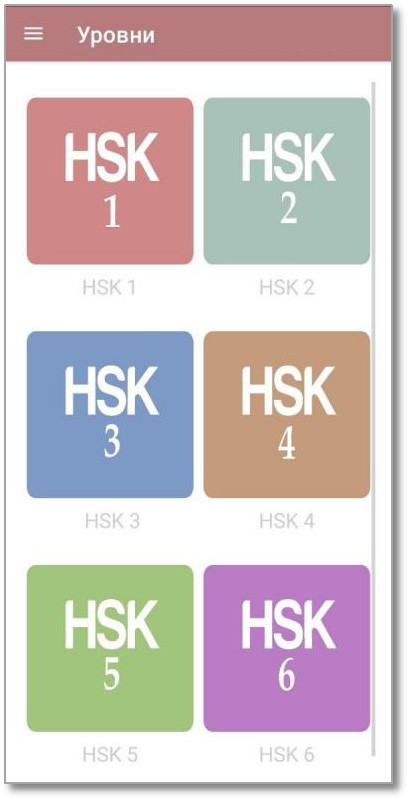 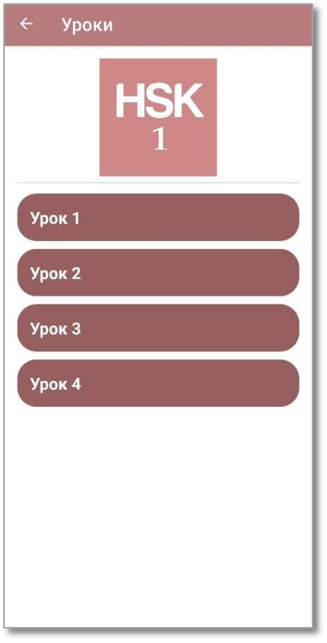 
</div>

Lesson materials are stored in Firebase Storage. To structure the data, collections "levels" and "lessons" were created in Firestore Database.

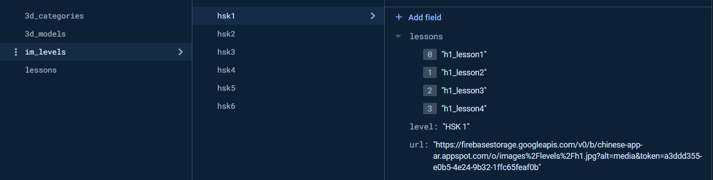

The "levels" collection contains documents corresponding to HSK levels. Each document includes the following fields:

lessons: an array with a list of Lessons (the lessons collection) available for this level.
level: the name of the level, displayed in the RecyclerView on the Levels screen.
url: a link to the image stored in Firebase Storage. This image is displayed in the RecyclerView on the Levels screen and also on the Lessons screen (for this level).
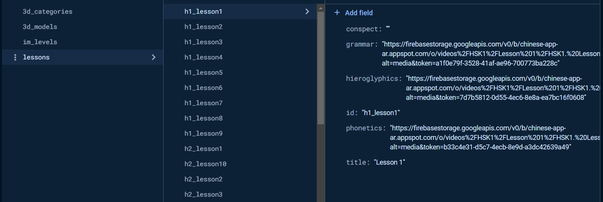

The "lessons" collection contains documents corresponding to lessons. Each document includes the following fields:

grammar: a link to the video lesson on the topic of Grammar.
hieroglyphics: a link to the video lesson on the topic of Hieroglyphics.
phonetics: a link to the video lesson on the topic of Phonetics.
title: the name of the lesson.
id: the lesson ID.
To retrieve data in the application, the following classes were implemented:

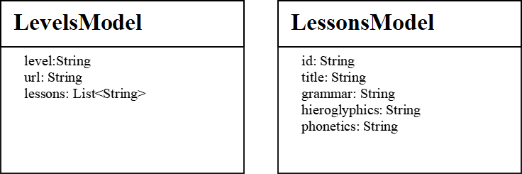

To display the list of levels, the list of lessons, and to populate each lesson, RecyclerView and an adapter were used.

RecyclerView is used to display large datasets in the form of a list or grid. It employs the ViewHolder pattern to improve performance by reusing views. The LayoutManager is responsible for arranging items in the RecyclerView. The following standard implementations are highlighted: LinearLayoutManager for vertical and horizontal lists, GridLayoutManager for grid display, and StaggeredGridLayoutManager for a staggered grid layout.

The Adapter acts as a bridge between the data and the views displayed in the RecyclerView.

The main tasks of the adapter include:

Creating and initializing the ViewHolder. The ViewHolder contains references to the views used to display data. This approach allows for view reuse and reduces the number of findViewById calls.
The adapter extracts data from the data source and binds it to the ViewHolder views. This allows for setting text, images, and other data in the corresponding user interface elements.
The adapter manages the dataset that will be displayed in the RecyclerView. It is responsible for informing the RecyclerView of changes in the data, such as adding, removing, or modifying items, allowing the RecyclerView to update its display accordingly.
For video playback, the ExoPlayer library is used. All videos in this section are stored in Firebase Storage. Access to each video occurs through collections and documents in the Firestore Database.

For developing the video player, I used the following libraries: ExoPlayer, ConnectivityManager, and NetworkCapabilities.

ExoPlayer is an open-source media player library that serves as an alternative to the standard Android MediaPlayer. It provides support for playing various types of audio and video formats, including adaptive streaming protocols such as DASH and HLS. ExoPlayer offers extensive customization and extension capabilities.

ExoPlayer has several advantages over the default Android MediaPlayer, including:

ExoPlayer supports adaptive streaming protocols such as DASH (Dynamic Adaptive Streaming over HTTP) and HLS (HTTP Live Streaming). This feature allows for dynamic adjustment of stream quality based on network conditions, resulting in smoother playback and reduced buffering.
ExoPlayer makes it easy to customize user interface components and media player controls.
ExoPlayer is designed to be modular and extensible, allowing for the addition of new features or functionalities to the media player by creating custom components.
ExoPlayer includes various digital rights management (DRM) schemes, including Widevine, PlayReady, and FairPlay, which are used to protect content from piracy.
ExoPlayer employs multiple threads and buffers for decoding and rendering media files, improving performance and reducing resource usage compared to the Android MediaPlayer.
ConnectivityManager is an Android library that allows applications to manage network connectivity on the device. It gathers information about network status, available network connections, and connection speed. ConnectivityManager is used in applications to check network connections and select the best quality connection.

ConnectivityManager allows for monitoring changes in network connectivity and responding to these changes. This feature is useful in cases where network availability is crucial for the application or when a specific type of connection is required for operation. For example, this is necessary when downloading large files only over Wi-Fi to avoid using mobile data and incurring additional costs for users.

NetworkCapabilities is an Android library that allows for determining the capabilities of network connectivity on the device. It provides information about the type of network, connection speed, and available network capabilities. It is used to determine whether the device can connect to a network with specific parameters, such as connection type and speed.

With NetworkCapabilities, it is possible to establish which features and capabilities are available on the device for a specific type of network connection. This information is necessary to ensure that the required capabilities and characteristics are supported for good application performance (for example, for streaming video or audio). Additionally, it can be useful for determining the availability of an internet connection and using it according to the application's requirements.


## 1.7. AR Room Section
The AR Room Menu provides access to lessons categorized by object types. On the AR Room screen, the lower panel displays object-words from the category as images. The following functions are available on this screen:

Placement of a 3D model on a surface.
The ability to view a short video for each object-word in a dialog fragment.
Dictionary - a dialog fragment that displays:
The word in Russian.
The word in Chinese (hieroglyphs).
Pinyin (pronunciation).
Example sentences (in Chinese, pinyin, and Russian).

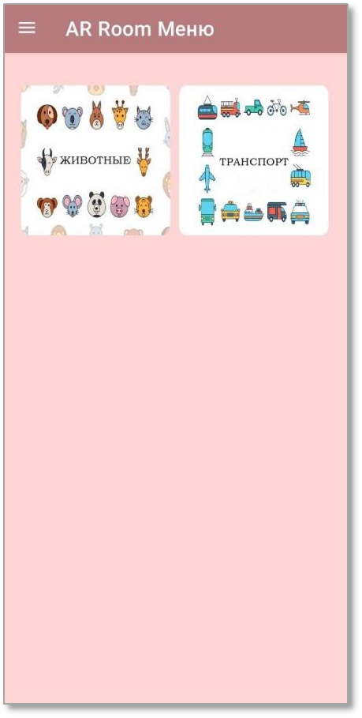 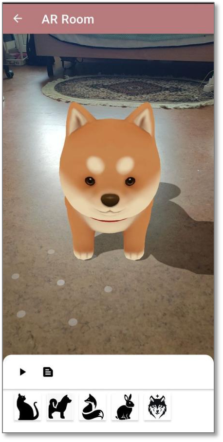 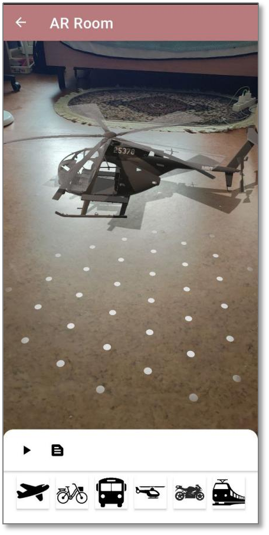

All data about 3D models and resources are stored in Firebase Storage. Each 3D model has a separate document in the Firestore Database. To structure the data, collections "3d_categories" and "3d_models" were created.

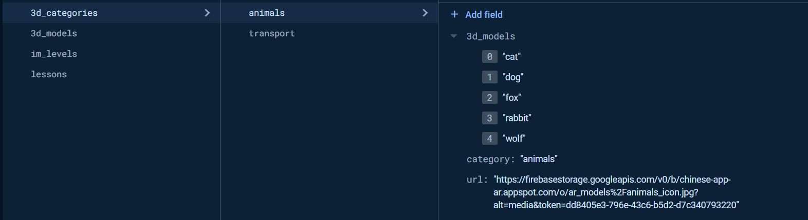

The "3d_categories" collection contains documents with category names. Each document includes the following fields:

3d_models: a list of 3D models related to this category (these models are stored in the "3d_models" collection).
category: the name of the category.
url: an image of the category, which is displayed in the AR Room Menu.

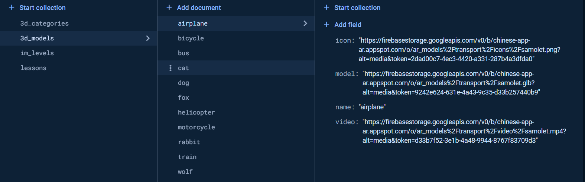

The "3d_models" collection contains documents with 3D models. Each document includes the following fields:

icon: an image displayed in the lower panel of the AR Room.
model: a link to the 3D model in GLB format.
name: the name of the object (this field is used to load data for the AR Room dictionary).
video: a link to the video resource for this word.
To retrieve data in the application, the following classes were implemented.

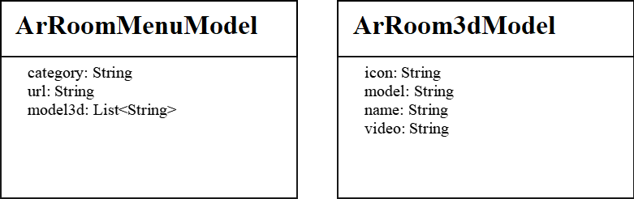

Sequence of Actions:
The user selects a category in the "AR Room Menu".
On the "AR Room" screen, surface detection occurs, and the lower panel displays lists of objects from this category for study in the form of icons. All of them are loaded via RecyclerView.

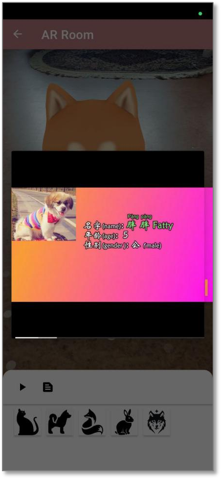 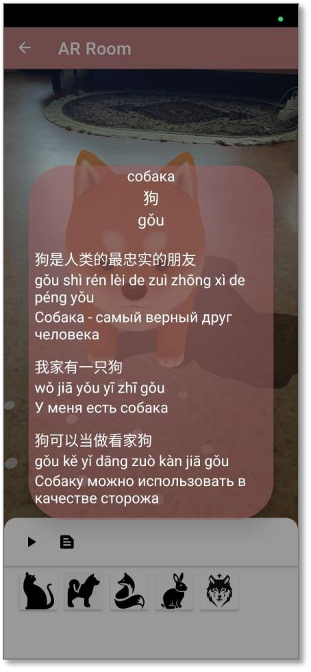

The user selects one of the words.
It is necessary to wait for the notification "Model generated" and then place the model on the detected surface.
The user can view a video (button) for the selected word or view the dictionary (button).
The lower panel can be collapsed and expanded. This is implemented using BottomSheetBehavior. This class is part of the Material Component library. It provides functionality for creating and managing bottom sheets.
This option provides quick access to 3D models and frees up screen space when the 3D model is placed. The data displayed in the "AR Room Dictionary" dialog is stored in Firebase Storage in a JSON file.

JSON File Structure (Listing 1):
Listing 1. "description.json"

```json
{
  "transport": [
    {
      "word": "airplane",
      "russian_word": "самолет",
      "chinese": {
        "hieroglyph": "飞机",
        "pinyin": "fēi jī"
      },
      "sentences": [
        {
          "chinese": "飞机是快速旅行的好方法",
          "pinyin": "fēi jī shì kuài sù lǚ xíng de hǎo fāng fǎ",
          "russian": "Самолет - хороший способ быстро путешествовать"
        },
        ...
      ]
    }
  ]
}
```
To extract data from the JSON file, the following classes were implemented.

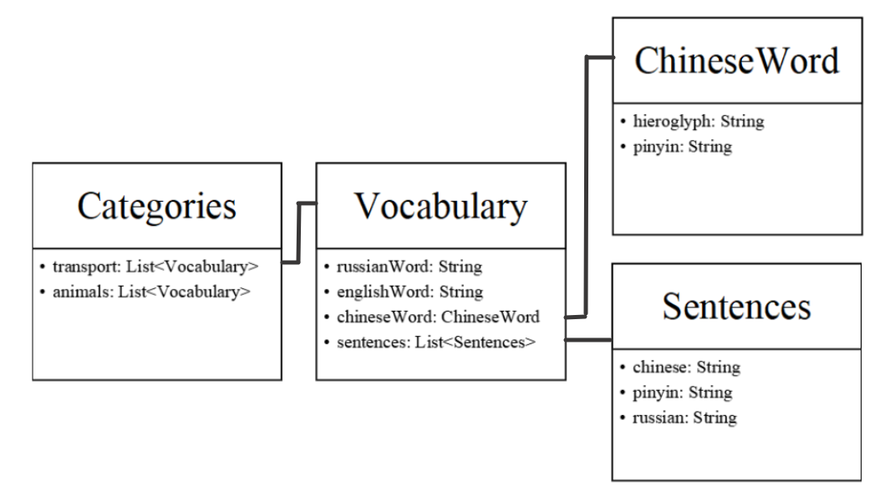

For working with augmented reality, AR Core and Sceneform are used.

ARCore is a platform developed by Google for creating interactive applications using augmented reality. With ARCore, a mobile device can perceive and understand the surrounding environment to interact with information.

ARCore has the following main capabilities: motion tracking, environmental understanding, and light estimation. These allow for placing virtual objects in the real world through the mobile device's camera.

To implement these capabilities, ARCore uses sensors and machine learning methods, allowing it to determine the position and orientation of the device in space.

For motion tracking, data from the camera and the device's inertial sensors (accelerometer and gyroscope) are used to determine the position and orientation of the device in space. This allows the device to track its movement and position relative to the surrounding environment in real-time. Thanks to visual-inertial odometry (VIO) algorithms, it is possible to combine visual data and sensor data for accurate motion tracking.

ARCore can recognize horizontal and vertical surfaces, enabling the placement of virtual objects on these surfaces. This feature is called Environmental Understanding. To implement this option, a plane detection algorithm is used, which analyzes images from the camera and determines the boundaries and orientation of planes in the real world.

ARCore can assess the lighting (Light Estimation) in the environment. This feature allows for more realistic rendering of virtual objects, as their brightness and color change according to the real lighting conditions.

For developing applications using ARCore, Google provides the ARCore SDK (Software Development Kit) for Android, which includes tools and libraries for integrating ARCore into applications written in Kotlin or Java. It includes code samples, documentation, and APIs for working with ARCore's core functionalities.

To work with ARCore, the following permissions must be provided in the Manifest.xml file:

"android.permission.CAMERA" - permission to access the camera.
"android.hardware.camera.ar" - permission to check if the device supports ARCore.
When using OpenGL, an additional permission must be added:

"glEsVersion="0x00020000" - this sets the minimum version of OpenGL.
Additionally, to use ARCore, metadata must be set:
```
xml
<meta-data
    android:name="com.google.ar.core"
    android:value="required"/>
```
To display 3D models and create AR space, the Sceneform library is used. 3D models are stored in GLB format.

Sceneform was developed by Google to simplify ARCore development. With Sceneform, it is possible to display a 3D scene in applications using AR without using OpenGL. It includes libraries for working with 3D graphics and provides capabilities for creating, displaying, and manipulating 3D objects.

Sceneform is optimized for mobile devices, ensuring high performance even when displaying complex three-dimensional models. It uses modern rendering and optimization technologies to ensure smooth and realistic rendering of objects.

Sceneform provides developers with extensive customization options for the appearance and behavior of three-dimensional objects. They can control lighting, textures, animations, and other aspects of the models using a simple and intuitive API.

To create a scene, ARFragment is used.

ARFragment is a component in the Sceneform library that simplifies the development of augmented reality applications. With ARFragment, ARCore is automatically initialized, the session is configured, and the lifecycle of the AR session is managed.

It allows for detecting surfaces on which 3D objects can be placed and displays visual indicators on detected planes. ARFragment handles screen touches, reads real-world coordinates, and provides the ability to interact with 3D objects.

Sceneform allows for loading ready-made 3D models in GLB and glTF formats.

The GLB (GL Transmission Format Binary) and glTF (GL Transmission Format) 3D model formats were developed by the Khronos Group to simplify the use and transmission of 3D models over the internet.

The figure shows the variety and multitude of different files that make up 3D models. It visually demonstrates the complexity of integrating them into a project.

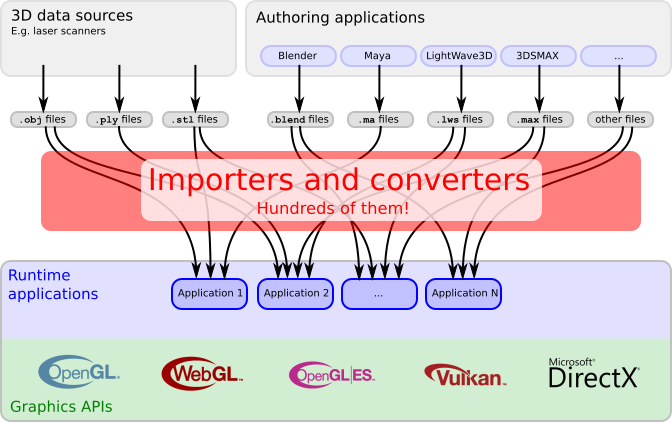

Now let's take a closer look at the GLB and GLTF formats.

glTF (GL Transmission Format)
glTF is a file format for transmitting 3D models and scenes.

GLTF typically consists of:

A file in .gltf format that contains the scene description (geometry, materials, animation, etc.) in JSON format.
A file in .bin format (all data for this scene).
GLTF files are more compact compared to 3D formats such as OBJ or FBX. This is achieved through various methods, such as binary encoding, which reduces file size by representing data in binary format rather than plain text, and data compression.

Due to the use of JSON, glTF files are easy to read and edit. They are optimized to minimize file size, which speeds up loading and rendering.

GLTF is supported by many software and hardware platforms (cross-platform).

GLB is the binary version of glTF. Unlike the text-based glTF, which consists of multiple files, GLB combines all components of the model into a single binary file. This makes it very convenient for transmission and use in applications where minimizing the number of files is important.

Key Features of GLB:
All model data, including geometry, materials, textures, and animations are contained in a single file.

Due to the lack of the need to make additional requests to load external files, it is characterized by fast loading.
Optimized to minimize data volume and speed up processing.
Comparison and Application
glTF is useful when it is necessary to easily edit or update parts of a model, as the JSON file is easy to read and edit manually or programmatically. GLB is most preferred for final transmission and use of models, especially in web applications where minimizing loading time and the number of network requests is important.

Due to its compactness and efficiency, these formats are well-suited for use in mobile 3D applications and games.

The significant difference between GLTF and GLB lies in their file formats and optimization for delivery over the Internet. GLTF is a text format that uses JSON to represent 3D models, while GLB is a binary format that encapsulates the GLTF file and its associated resources, such as textures and animations, into a single binary file.

GLB files are more compact and efficient for web optimization; when running 3D models, they reduce file size and loading time compared to GLTF files, which require additional parsing and processing.

GLB is often preferred for web applications with 3D graphics, where fast loading and smooth rendering are essential.

3D models in these formats can be efficiently transmitted over the Internet or loaded directly into applications, providing a user-friendly experience with minimal latency.


## 1.8. Quizlet Section
This section provides an opportunity for students to test their knowledge. On the Quizlet screen, a list of all available tests is displayed, along with the time allocated for completing them.

On the Quizlet Question screen, one of the test questions is displayed along with the answer options. The time for completion is counted down. After finishing the test, a dialog window appears showing the results in terms of the number of correct answers and the percentage score.

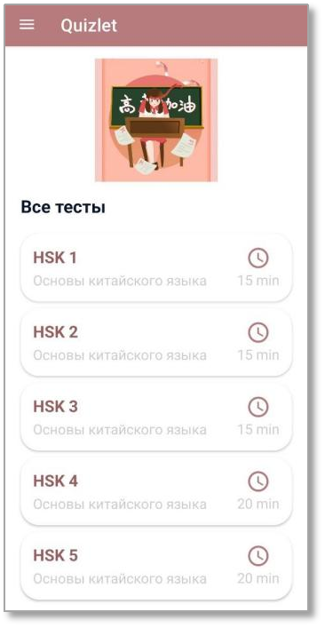 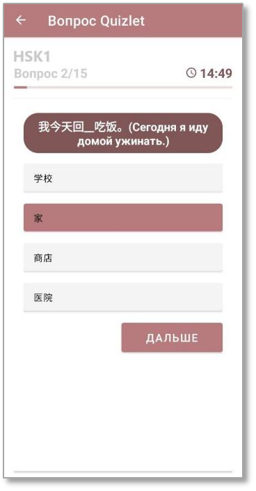 

The data for this section is stored in Realtime Database. The following classes were implemented to extract the data:

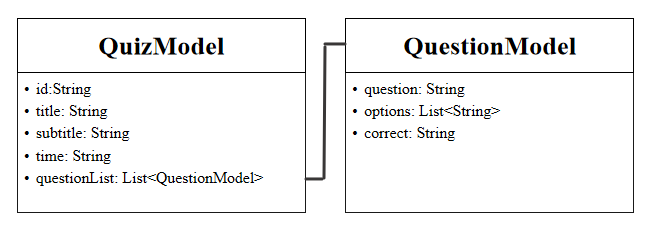


# Conclusion
The aim of the graduation qualification work was to develop a multimedia mobile application for the effective study of the Chinese language using modern computer vision and augmented reality technologies.

Within the framework of the research, the following tasks were addressed, which allowed for the achievement of the set goal:

A review of existing methods for teaching foreign languages was conducted. The advantages and disadvantages were identified in terms of effectiveness and user appeal. Methods were selected as the basis for the further development of the application.

Analogous applications for learning Chinese and foreign languages that utilize modern virtual, augmented reality, and computer vision technologies were examined.

The architecture of the application was developed, and requirements for the functionality and interface of the multimedia mobile application were formulated.

The application was implemented using modern technologies:

- A section with lessons was developed, allowing for a comprehensive approach to mastering the Chinese language and the lexical-grammatical method.
- An augmented reality mode was implemented, providing an engaging language learning experience through immersion and communicative methods.
- A testing mode was introduced, allowing users to check their knowledge and track their learning progress.
- The ability to collect statistics for monitoring user activity was included.

The implementation of this foreign language learning program using augmented reality technologies provides a unique opportunity for students to immerse themselves in a language environment and interact with various objects.

Using such a program will not only facilitate effective language acquisition but also develop communication skills, adaptability to different linguistic contexts, and increase motivation for learning, creating an interactive and engaging environment for learners.

